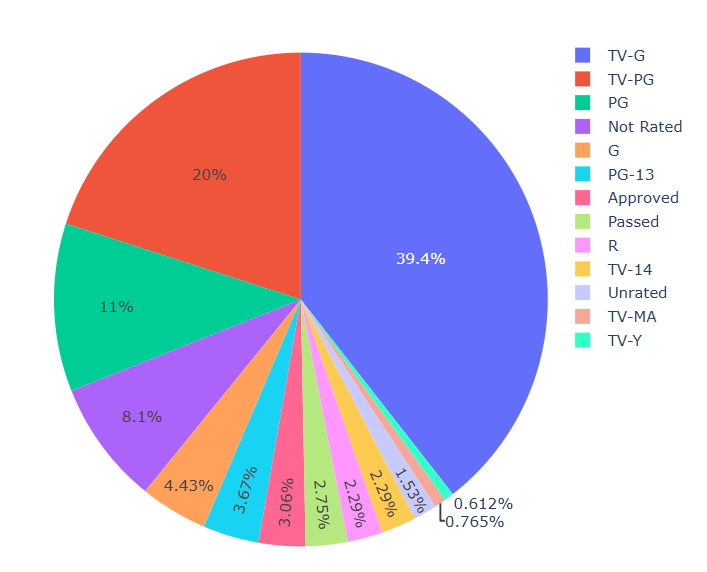

# 📊 Data Visualization Projects

Welcome to my collection of **Data Visualization** projects. This repository showcases a range of visual explorations, analyses, and dashboards that help translate complex datasets into intuitive and informative graphics.

  

## 📁 Projects Included

| Project Name                 | Description                                                                 |
|------------------------------|-----------------------------------------------------------------------------|
| **Christmas Movies-EDA**           | Interactive visualization using Plotly and Dash. |
| **IMDB Movies-EDA**    | analysis and visualization of data and trends. |
| **Cheese-EDA**     | analysis and visualization of data. |

---

## 🔧 Technologies Used

- Python  
- Pandas / NumPy  
- Matplotlib / Seaborn  
- Plotly / Dash  
- Tableau (in select projects)  
- Jupyter Notebook  
